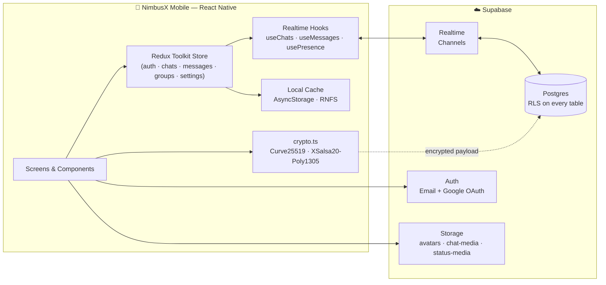
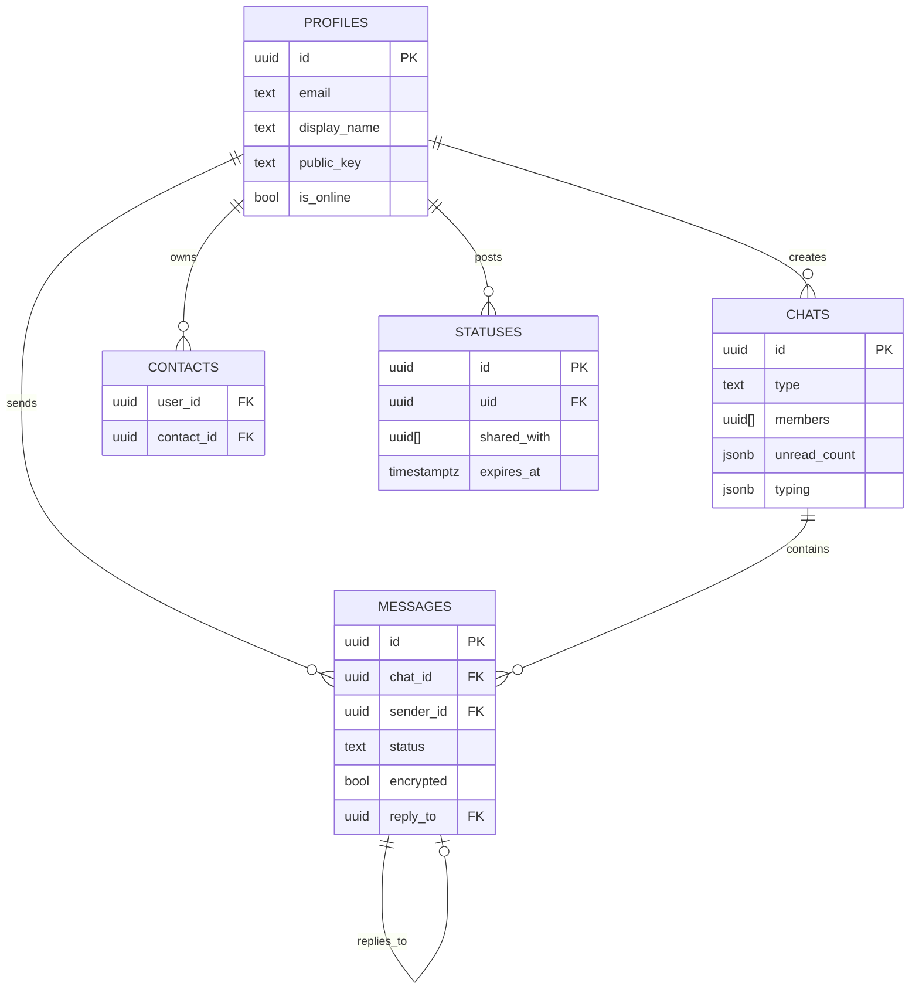

<div align="center">



<br/>


<br/><br/>

[](#)
[](#)
[](#)
[](#)
[](#license)

<br/>

**NimbusX** is a privacy-first, real-time communication platform — one-to-one chats, groups, ephemeral **Pulse** stories, and true end-to-end encryption, built on a modern React Native + Supabase stack.

[Overview](#-overview) · [Features](#-features) · [Architecture](#-architecture) · [Tech Stack](#-tech-stack) · [Getting Started](#-getting-started) · [Project Structure](#-project-structure) · [Database](#-database-schema) · [Roadmap](#-roadmap) · [Contributing](#-contributing)

</div>

<br/>


<br/>

## 📖 Overview

NimbusX is a full-featured, production-grade messaging application for iOS and Android. It pairs a polished React Native front end with a Supabase backend (Postgres + Realtime + Storage + Auth) and adds a client-side **end-to-end encryption layer** built on Curve25519 and XSalsa20-Poly1305 — so message content never touches the server in plaintext for one-to-one conversations.

It's built the way a startup would ship a v1: typed end-to-end, themeable, offline-resilient, and instrumented for CI from day one.

<table>
<tr>
<td width="33%" valign="top">

### 💬 Real conversations

1-to-1 and group messaging with typing indicators, read receipts, replies, edits, and rich media — all in real time.

</td>
<td width="33%" valign="top">

### 🔐 Private by default

Client-side E2EE for direct messages, safety codes for identity verification, PIN lock, and 2FA.

</td>
<td width="33%" valign="top">

### ⚡ Built to scale

Typed Redux store, entity adapters, offline queueing, and a Postgres schema with RLS on every table.

</td>
</tr>
</table>

<br/>

## ✨ Features

<table>
<tr><th align="left">Category</th><th align="left">Capabilities</th></tr>

<tr>
<td><strong>Messaging</strong></td>
<td>

- One-to-one & group chats with realtime delivery
- Message replies, edits, pinning
- Delivery states: `pending → sent → delivered → read`
- Typing indicators & online presence
- Offline queue with automatic retry
</td>
</tr>

<tr>
<td><strong>Privacy & Security</strong></td>
<td>

- End-to-end encryption (Curve25519 ECDH + XSalsa20-Poly1305) for direct messages
- 25-digit safety codes for out-of-band identity verification
- App lock (PIN), simulated two-factor authentication
- Granular privacy controls — read receipts, last seen, profile photo visibility
- Blocked users management & data export requests
</td>
</tr>

<tr>
<td><strong>Pulse (Stories)</strong></td>
<td>

- 24-hour ephemeral text/image posts
- Fine-grained recipient sharing via <code>shared_with</code>
- Dedicated composer & full-screen viewer
</td>
</tr>

<tr>
<td><strong>Groups</strong></td>
<td>

- Group creation with avatar, description & multi-select members
- Admin roles & participant management
- Group-level notification and media settings
</td>
</tr>

<tr>
<td><strong>Media</strong></td>
<td>

- Image, document, and file sharing via Supabase Storage
- Emoji picker + Giphy-powered GIF search
- Local image caching for fast reloads
</td>
</tr>

<tr>
<td><strong>Personalization</strong></td>
<td>

- 6 themes: Dark, Light, System, Slate, Teal, Emerald
- Custom wallpapers, enter-to-send toggle
- Configurable notification tones, vibration & priority per surface
</td>
</tr>

<tr>
<td><strong>Account & Trust</strong></td>
<td>

- Email + Google Sign-In
- Active session / device management
- Cloud vs. local-only storage mode on first launch
- Help center, support tickets, ToS & privacy policy screens
</td>
</tr>
</table>

<br/>

## 🏗️ Architecture

<div align="center">



</div>

**Encryption flow (1-to-1 chats):** the sender fetches the recipient's public key, generates an ephemeral keypair, derives a shared secret via ECDH, and encrypts the message body client-side before it ever reaches Postgres. Decryption happens symmetrically on receipt — the server only ever stores ciphertext.

<br/>

## 🧰 Tech Stack

<div align="center">


</div>

| Layer      | Choice                                       | Why                                                         |
| ---------- | -------------------------------------------- | ----------------------------------------------------------- |
| UI runtime | React Native 0.84 + React 19                 | New architecture, first-class TS support                    |
| Language   | TypeScript (strict)                          | End-to-end type safety, 14 path aliases                     |
| State      | Redux Toolkit + `redux-persist`              | Predictable state, entity adapters for chats/messages/users |
| Navigation | React Navigation (stack + bottom tabs)       | Nested auth/main/chat stacks                                |
| Backend    | Supabase (Postgres, Auth, Realtime, Storage) | Managed Postgres with RLS instead of a bespoke backend      |
| Encryption | `tweetnacl` (Curve25519 / XSalsa20-Poly1305) | Audited, battle-tested primitives for E2EE                  |
| Storage    | AsyncStorage + `react-native-fs`             | Persisted Redux slices + local media cache                  |

<br/>

## 🚀 Getting Started

### Prerequisites

- Node.js ≥ 18, npm
- A Supabase project (URL + anon key)
- Xcode (iOS) and/or Android Studio (Android)
- CocoaPods (iOS)

### Installation

```bash
# 1. Clone
git clone https://github.com/NimbusX-labs/NimbusX-Mobile.git
cd NimbusX-Mobile

# 2. Install dependencies
npm install

# iOS only
cd ios && pod install && cd ..

# 3. Configure environment
cp .env.example .env
# then set SUPABASE_URL, SUPABASE_ANON_KEY, GOOGLE_WEB_CLIENT_ID

# 4. Apply the database schema
python scripts/migrate.py

# (optional) seed demo users — Alice, Bob, Carol
python scripts/seed.py
```

### Run

```bash
# Metro bundler
npm start

# iOS
npm run ios

# Android
npm run android
```

There's also a guided bootstrap script for a fresh machine:

```powershell
./scripts/setup.ps1 -All
```

### Quality checks

```bash
npm run lint      # ESLint
npx tsc --noEmit  # Type check
npm test          # Jest
```

<br/>

## 📁 Project Structure

```
NimbusX-Mobile/
├── src/
│   ├── screens/          # auth · chats · groups · settings · status
│   ├── components/       # chat/ and common/ UI building blocks
│   ├── navigation/        # stack & tab navigators + typed params
│   ├── store/             # Redux slices (auth, chat, message, group, settings, user)
│   ├── services/          # Supabase database.ts, storage.ts, caching, notifications
│   ├── hooks/             # useAuth, useChats, useMessages, usePresence, useAppState
│   ├── utils/              # crypto.ts, dateUtils, formatters, validation
│   ├── theme/              # colors, spacing, typography
│   └── types/               # User, Message, Chat, Group, Status
├── supabase-schema.sql            # Core schema + RLS
├── supabase-e2ee-migration.sql    # Public keys, key exchange, encrypted flag
├── supabase-pulse-migration.sql   # Pulse sharing (shared_with + RLS)
├── scripts/                        # migrate.py · seed.py · setup.ps1
├── docs/                           # architecture, API reference, assets
└── .github/workflows/               # ci.yml · lint.yml
```

<br/>

## 🗄️ Database Schema

<div align="center">



</div>

Every table ships with Row Level Security — chat access is scoped to `auth.uid() = ANY(members)`, messages are gated by an `is_chat_member()` helper, and Pulse visibility checks both authorship and the `shared_with` array with a 24-hour TTL.

<br/>

## 🗺️ Roadmap

- [x] Core messaging, groups & realtime sync
- [x] Client-side end-to-end encryption
- [x] Pulse (24h ephemeral stories)
- [x] Theming system (6 themes, 3 accents)
- [ ] Voice & video calling
- [ ] Multi-device E2EE key sync
- [ ] Message search
- [ ] Desktop companion app

<br/>

## 🤝 Contributing

Contributions are welcome. Please open an issue before starting significant work.

1. Fork the repo and create a branch: `git checkout -b feature/your-feature`
2. Follow the existing lint/format rules — `npm run lint` must pass
3. Add or update tests where relevant
4. Open a PR using the provided template

See `.github/ISSUE_TEMPLATE` for bug report and feature request formats.

<br/>

## 📄 License

Distributed under the MIT License.

<br/>

<div align="center">


<sub>Made with 💙 by the NimbusX team</sub>

</div>
